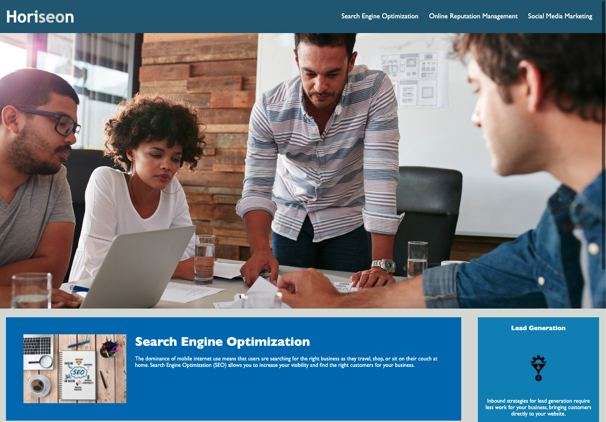
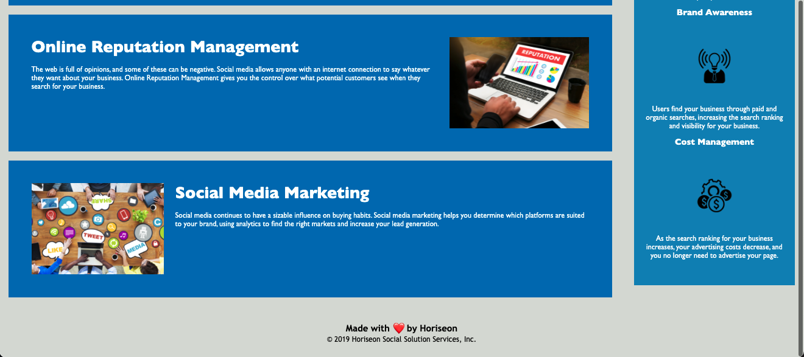

Challenge 1: Horiseon Landing Page
Introduction: The purpose of this project is to identify errors on the Horiseon landing page, correct those errors, and ensure that the landing page meets accessibility requirements. This was accomplished via consolidating and organizing the css properties, as well as editing HTML to add accessibility requirements. 
    Deployed URL: https://emackenziesmith.github.io/Horiseon-Solutions/
        Files Included: 
        1. index.html
        2. style.css
        3. .gitignore
        4. images
            1. brand-awareness.png
            2. cost-management.png
            3. digital-marketing-meeting.jpg
            4. lead-generation.png
            5. online-reputation-management.jpg
            6. search-engine-optimization.jpg
            7. social-media-marketing.jpg
    Distributor Info: 
        emackenziesmith@gmail.com
        GitHub: emackenziesmith

